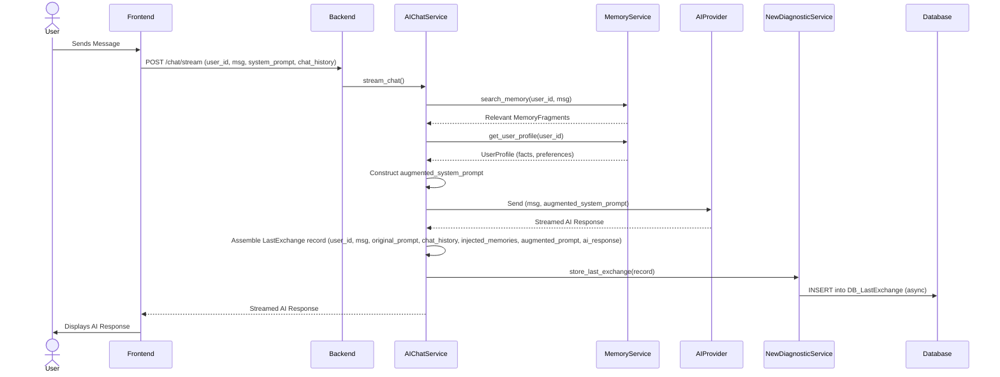
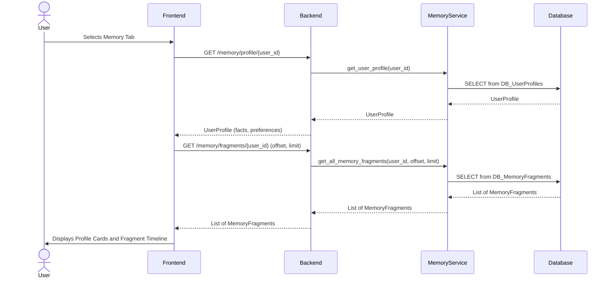
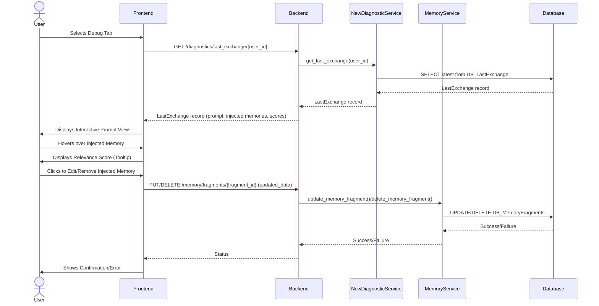

# Memory & Diagnostics Hub Technical Design Document

## 1. Overview

The Memory & Diagnostics Hub is a critical new feature within the AI Accompany project, designed to enhance user understanding and control over the AI's conversational memory and decision-making processes. Built on a React frontend, FastAPI backend, and PostgreSQL (pgvector) database, this hub provides a transparent view into how the AI perceives and retains information.

### 1.1 Project Context
The AI Accompany project aims to provide an intelligent conversational AI experience. The technical stack comprises:
- **Frontend**: React
- **Backend**: FastAPI
- **Database**: PostgreSQL with pgvector for efficient vector-based similarity searches, crucial for memory retrieval.

### 1.2 Feature Overview
The Memory & Diagnostics Hub introduces a three-tab interface in the frontend: `Chat`, `Memory`, and `Debug`.

#### 1.2.1 Memory Tab
This tab will allow users to inspect the AI's long-term memory. It will feature:
-   **Profile Cards**: Visual representation of extracted facts and user preferences the AI has learned.
-   **Fragment Timeline**: A chronological view of memory fragments, allowing users to trace the evolution of the AI's understanding over time.

#### 1.2.2 Debug Tab
The Debug tab offers an interactive way to understand the AI's real-time reasoning during a conversation. Key functionalities include:
-   **Interactive Prompt View**: Display of the AI's current prompt, with specifically highlighted injected memories.
-   **Hover Scores**: As users hover over injected memory fragments, a relevance score will be displayed, indicating why that specific memory was chosen.
-   **Click-to-Edit Functionality**: Users can directly edit or remove injected memories within the prompt to observe how changes influence the AI's response, aiding in debugging and fine-tuning.

### 1.3 Backend Requirements
To support these frontend features, the backend will require:
-   **Last Exchange Store**: A mechanism to store the most recent conversational exchange details for diagnostic purposes.
-   **Diagnostic Endpoints**: APIs to expose relevant memory and prompt data to the frontend.
-   **Memory Update Endpoints**: APIs to allow modifications to memory fragments (e.g., via the click-to-edit feature).


## 2. Architecture

The Memory & Diagnostics Hub will be integrated into the existing React/FastAPI/PostgreSQL (pgvector) architecture. This section outlines the key components and their interactions.

### 2.1 High-Level Architecture Diagram

```mermaid
graph TD
    User -->|Requests/Interacts| Frontend(React App)
    Frontend -->|API Calls| Backend(FastAPI)
    Backend -->|Database Queries| PostgreSQL(pgvector)

    subgraph Frontend Components
        FE_Root(Root Component) --> FE_Tabs(Memory & Diagnostics Hub Tabs)
        FE_Tabs --> FE_ChatTab(Chat Tab - Existing)
        FE_Tabs --> FE_MemoryTab(Memory Tab)
        FE_Tabs --> FE_DebugTab(Debug Tab)
        FE_MemoryTab --> FE_ProfileCards(Profile Cards)
        FE_MemoryTab --> FE_FragmentTimeline(Fragment Timeline)
        FE_DebugTab --> FE_InteractivePromptView(Interactive Prompt View)
    end

    subgraph Backend Services
        BE_Router(API Router) --> BE_ChatService(AIChatService)
        BE_Router --> BE_MemoryService(MemoryService)
        BE_Router --> BE_NewDiagnosticService(New Diagnostic/Last Exchange Service)
    end

    subgraph Database
        DB_UserProfiles(User Profiles Table)
        DB_MemoryFragments(Memory Fragments Table)
        DB_LastExchange(Last Exchange Store Table - New)
    end

    FE_ChatTab -- Calls stream_chat --> BE_ChatService
    FE_MemoryTab -- Calls get_profile, get_fragments --> BE_MemoryService
    FE_DebugTab -- Calls get_last_exchange_diagnostics, update_memory_fragment --> BE_NewDiagnosticService, BE_MemoryService

    BE_ChatService -- Uses --> BE_MemoryService
    BE_ChatService -- Stores last exchange in --> DB_LastExchange
    BE_MemoryService -- Interacts with --> DB_UserProfiles
    BE_MemoryService -- Interacts with --> DB_MemoryFragments
    BE_NewDiagnosticService -- Reads from --> DB_LastExchange
```

### 2.2 Frontend Components

The frontend, built with React, will introduce two new tabs within the main application interface, alongside the existing Chat tab.

#### 2.2.1 Memory & Diagnostics Hub Tabs
-   A new top-level component that manages the state and navigation between the `Chat`, `Memory`, and `Debug` tabs.

#### 2.2.2 Memory Tab (`FE_MemoryTab`)
-   **Profile Cards (`FE_ProfileCards`)**: Displays key facts and preferences extracted from the user's conversation history, retrieved from the `UserProfile` data.
-   **Fragment Timeline (`FE_FragmentTimeline`)**: Renders a chronological list of `MemoryFragment` entries, allowing users to view the raw content and metadata of each stored memory. Will include pagination/infinite scroll for large datasets.

#### 2.2.3 Debug Tab (`FE_DebugTab`)
-   **Interactive Prompt View (`FE_InteractivePromptView`)**:
    -   Displays the full prompt sent to the AI, including the system prompt, chat history, and injected long-term memories.
    -   Injected memories will be visually highlighted (e.g., different background color, border).
    -   On hover, a tooltip will show the relevance score of the injected memory (how it was selected).
    -   Clicking on an injected memory will enable editing or removal, which will then trigger an update to the `MemoryFragment` in the backend.

### 2.3 Backend Services

The FastAPI backend will extend existing services and introduce a new one to support the hub.

#### 2.3.1 `AIChatService` (`BE_ChatService`)
-   **Modification**: Will be updated to store the full diagnostic context of each chat exchange (user message, system prompt, chat history, retrieved memory fragments, final augmented prompt) into a new `Last Exchange Store` in the database after an AI response is generated. This is crucial for the Debug tab.
-   Continues to handle AI provider routing and memory injection into the prompt.

#### 2.3.2 `MemoryService` (`BE_MemoryService`)
-   **Extension**: Will include new endpoints/methods to:
    -   Retrieve all `MemoryFragment`s for a `user_id` (potentially with pagination/filters).
    -   Retrieve a specific `UserProfile` by `user_id`.
    -   Update or delete specific `MemoryFragment`s.
    -   Exposing more granular access to raw memory fragments for the frontend display.

#### 2.3.3 New Diagnostic/Last Exchange Service (`BE_NewDiagnosticService`)
-   **New Service**: Responsible for:
    -   Retrieving the most recent exchange data from the `Last Exchange Store` for a given `user_id`.
    -   Preparing and formatting this data for display in the `Debug` tab.

### 2.4 Database

PostgreSQL with `pgvector` will be the persistence layer.

#### 2.4.1 `UserProfile` Table (`DB_UserProfiles`)
-   Existing table. Stores user-specific data, including extracted `facts` and `preferences`. The `data` column (JSONB) will be used to store these profile cards.

#### 2.4.2 `MemoryFragment` Table (`DB_MemoryFragments`)
-   Existing table. Stores individual memory fragments, their content, embeddings, and metadata. Will be queried more extensively by the `MemoryService` for the timeline.

#### 2.4.3 `LastExchange` Table (`DB_LastExchange` - New)
-   **New Table**: Stores the diagnostic information for the last conversational exchange for each user.
    -   `user_id` (FK to User)
    -   `timestamp`
    -   `user_message`
    -   `original_system_prompt`
    -   `chat_history` (JSONB)
    -   `injected_memory_fragments` (JSONB - list of fragments with content and relevance scores)
    -   `final_augmented_prompt`
    -   `ai_response`
    -   `metadata` (JSONB - for future extensions, e.g., model used, tokens)

## 3. Data Flow

This section details the flow of data within the system for the Memory & Diagnostics Hub, covering chat interactions with diagnostic capture, and data retrieval for both the Memory and Debug tabs.

### 3.1 Chat Interaction with Diagnostic Data Capture

This flow describes a typical chat interaction, highlighting the new steps for capturing diagnostic information.

1.  **User Sends Message**: The user types a message in the Frontend Chat Tab and sends it.
2.  **Frontend API Call**: The Frontend sends a `POST /chat/stream` request to the FastAPI Backend, including `user_id`, `message`, `system_prompt`, and `chat_history`.
3.  **Backend `AIChatService`**:
    *   Receives the request.
    *   Calls `MemoryService.search_memory()` with `user_id` and `message` to retrieve relevant `MemoryFragment`s.
    *   Calls `MemoryService.get_user_profile()` to fetch user facts and preferences.
    *   Constructs the `augmented_system_prompt` by injecting retrieved memories and user profile data into the `system_prompt`.
    *   Sends the `message` and `augmented_system_prompt` to the selected AI Provider (e.g., Gemini).
    *   Streams AI response back to the Frontend.
4.  **Diagnostic Data Capture**:
    *   **After** receiving the full AI response and **before** finalizing the response to the user, the `AIChatService` constructs a `LastExchange` record.
    *   This record includes: `user_id`, `user_message`, `original_system_prompt`, `chat_history`, the list of `injected_memory_fragments` (including their content and relevance scores), the `final_augmented_prompt`, and `ai_response`.
    *   The `AIChatService` then calls a method in the `BE_NewDiagnosticService` (e.g., `store_last_exchange`) to persist this record in the `DB_LastExchange` table. This step is asynchronous to not block the user's chat experience.
5.  **Frontend Displays Response**: The Frontend receives and displays the streamed AI response.



### 3.2 Memory Tab Data Retrieval

This flow describes how data is retrieved for display in the Memory Tab.

1.  **User Selects Memory Tab**: The user navigates to the Memory Tab in the Frontend.
2.  **Frontend API Calls**:
    *   Frontend sends a `GET /memory/profile/{user_id}` request to retrieve the user's profile.
    *   Frontend sends a `GET /memory/fragments/{user_id}` request (with optional pagination/filtering parameters) to retrieve all memory fragments.
3.  **Backend `MemoryService`**:
    *   `GET /memory/profile/{user_id}`: Calls `MemoryService.get_user_profile(user_id)` to fetch the `UserProfile`.
    *   `GET /memory/fragments/{user_id}`: Calls `MemoryService.get_all_memory_fragments(user_id, ...)` to fetch `MemoryFragment` records.
    *   These records are returned to the Frontend.
4.  **Frontend Displays Data**:
    *   `FE_ProfileCards` renders the extracted facts and preferences from the `UserProfile`.
    *   `FE_FragmentTimeline` renders the chronological list of `MemoryFragment`s.



### 3.3 Debug Tab Data Retrieval and Interaction

This flow describes how data is retrieved and how interactions occur within the Debug Tab.

1.  **User Selects Debug Tab**: The user navigates to the Debug Tab in the Frontend.
2.  **Frontend API Call (Initial Load)**: Frontend sends a `GET /diagnostics/last_exchange/{user_id}` request to the Backend.
3.  **Backend `BE_NewDiagnosticService`**:
    *   Receives the request.
    *   Calls a method to retrieve the latest `LastExchange` record for the `user_id` from the `DB_LastExchange` table.
    *   Returns the `LastExchange` record (including `original_system_prompt`, `chat_history`, `injected_memory_fragments`, `final_augmented_prompt`) to the Frontend.
4.  **Frontend Displays Interactive Prompt View**:
    *   `FE_InteractivePromptView` displays the `final_augmented_prompt`.
    *   It highlights the `injected_memory_fragments` within the prompt.
    *   When the user hovers over an injected fragment, a tooltip displays its relevance score (parsed from the `injected_memory_fragments` data).
5.  **User Interaction (Edit/Remove Memory)**:
    *   If a user clicks to edit or remove an injected memory fragment (e.g., changes its content or flags it for removal), the Frontend constructs an update request.
    *   Frontend sends a `PUT /memory/fragments/{fragment_id}` or `DELETE /memory/fragments/{fragment_id}` request to the Backend, with the updated or deletion-flagged `MemoryFragment` data.
6.  **Backend `MemoryService` (Update/Delete)**:
    *   Receives the `PUT` or `DELETE` request.
    *   Performs the corresponding update or deletion operation on the `DB_MemoryFragments` table.
    *   Returns a success/failure status to the Frontend.
7.  **Frontend Feedback**: The Frontend updates the UI to reflect the change. (Note: Changes to memory fragments will affect future AI responses, not the currently displayed last exchange.)



## 4. UI/UX Details

The user interface for the Memory & Diagnostics Hub will be designed for clarity, interactivity, and ease of use, providing users with transparent insights into the AI's internal workings.

### 4.1 Overall Hub Layout

The hub will be presented as a distinct section within the main application, likely occupying a significant portion of the screen real estate when active.
-   **Tab Navigation**: A clear tab-based navigation system will allow users to switch between "Chat" (existing), "Memory", and "Debug" views. Tabs should be visually distinct and indicate the active selection.
-   **Consistent Styling**: The new tabs and their components will adhere to the existing application's design system, ensuring a cohesive look and feel.

### 4.2 Memory Tab

The Memory Tab (`FE_MemoryTab`) provides a historical overview of the AI's learned information about the user.

#### 4.2.1 Profile Cards (`FE_ProfileCards`)
-   **Layout**: A grid or flow layout of distinct "cards" at the top section of the Memory tab. Each card will represent a category of learned information (e.g., "Facts", "Preferences", "Emotional State").
-   **Content**: Each card will display a concise summary or a list of bullet points for the respective category (e.g., "Likes coffee", "Works as a software engineer").
-   **Interactivity**: Cards could be expandable to show more detail or editable (e.g., a "pencil" icon to open a modal for editing a fact, which then updates the UserProfile via API).

#### 4.2.2 Fragment Timeline (`FE_FragmentTimeline`)
-   **Layout**: A scrollable, chronological list below the Profile Cards. Each item in the list represents a `MemoryFragment`.
-   **Content**: Each fragment entry will display:
    *   **Timestamp**: When the memory was recorded.
    *   **Source Conversation**: A snippet of the user/AI exchange that led to this memory (truncated for brevity, expandable if needed).
    *   **Extracted Data**: Key facts/preferences/emotional state extracted from this specific fragment.
    *   **Metadata**: Optionally, display raw metadata if it's relevant for advanced users.
-   **Interactivity**:
    *   **Search/Filter**: A search bar and filter options (e.g., by date range, by content type) to help users navigate large timelines.
    *   **Infinite Scroll/Pagination**: Efficient loading of fragments to ensure smooth performance for users with extensive memory histories.
    *   **Detail View**: Clicking on a fragment could expand it to show full content and associated metadata.
    *   **Edit/Delete**: Icons (e.g., trash can, pencil) next to each fragment to allow users to modify or remove it, which updates the backend.

### 4.3 Debug Tab

The Debug Tab (`FE_DebugTab`) is highly interactive, designed to help users understand the AI's reasoning process during a specific conversation.

#### 4.3.1 Interactive Prompt View (`FE_InteractivePromptView`)
-   **Layout**: A large, read-only text area displaying the `final_augmented_prompt` from the `LastExchange` record.
-   **Highlighting Injected Memories**:
    *   Injected memory fragments within the prompt text will be visually distinct. This could be achieved with a subtle background color, a different text color, or a soft border.
    *   Each highlighted segment should correspond to an `injected_memory_fragment` from the `LastExchange` data.
-   **Hover Scores**:
    *   When the user hovers their mouse over a highlighted injected memory, a tooltip or small pop-over will appear.
    *   This tooltip will display the "relevance score" associated with that specific memory fragment, explaining why it was chosen for injection.
-   **Click-to-Edit Functionality**:
    *   Clicking on a highlighted injected memory will open a small, in-line editor or a modal.
    *   This editor will allow the user to modify the content of the `MemoryFragment` directly or mark it for deletion.
    *   Upon submission, the changes will be sent to the backend via the `PUT /memory/fragments/{fragment_id}` or `DELETE /memory/fragments/{fragment_id}` API.
    *   A visual indicator (e.g., "Saved!", "Deleted!") will confirm the action.

### 4.4 Design Principles

-   **Transparency**: Clearly show what memories are being used and why.
-   **Control**: Empower users to inspect, modify, and manage the AI's memory.
-   **Usability**: Intuitive interactions, clear visual cues, and accessible design.
-   **Performance**: Efficient rendering of large datasets (e.g., memory fragments) and responsive interactions.
-   **Feedback**: Provide clear feedback for user actions (e.g., saving changes, deletion).

## 5. API Specifications

This section details the API endpoints necessary to support the Memory & Diagnostics Hub features. All APIs will be exposed via the FastAPI backend.

### 5.1 Common Models (Pydantic)

These models define the structure of data exchanged between the frontend and backend.

```python
# Assuming existing models like UserProfile and MemoryFragment in schemas.py or models.py
# For UserProfile:
class UserProfileResponse(BaseModel):
    user_id: str
    data: Dict[str, Any]  # Contains 'facts', 'preferences', 'last_emotional_state'

# For MemoryFragment:
class MemoryFragmentResponse(BaseModel):
    id: int
    user_id: str
    topic_id: Optional[int]
    content: str
    embedding: List[float] # This might be omitted for frontend display to save bandwidth
    metadata_: Dict[str, Any] # e.g., extracted_facts, extracted_preferences, extracted_emotional_state
    timestamp: datetime

class MemoryFragmentUpdate(BaseModel):
    content: Optional[str] = None
    metadata_: Optional[Dict[str, Any]] = None # Allow updating specific metadata fields

# For LastExchange:
class InjectedMemoryDetail(BaseModel):
    fragment_id: int
    content: str
    relevance_score: float # Score from vector search

class LastExchangeResponse(BaseModel):
    id: int
    user_id: str
    timestamp: datetime
    user_message: str
    original_system_prompt: str
    chat_history: List[ChatMessage] # Assuming ChatMessage schema exists
    injected_memory_fragments: List[InjectedMemoryDetail]
    final_augmented_prompt: str
    ai_response: str
    metadata: Dict[str, Any] # For future use
```

### 5.2 Memory Service APIs (`/api/memory`)

These APIs primarily support the Memory Tab.

#### 5.2.1 Get User Profile

-   **Endpoint**: `/api/memory/profile/{user_id}`
-   **Method**: `GET`
-   **Description**: Retrieves the user's comprehensive profile including facts and preferences.
-   **Request**:
    -   **Parameters**:
        -   `user_id` (path): The ID of the user.
-   **Response**:
    -   **Success (200 OK)**: `UserProfileResponse`
        ```json
        {
            "user_id": "user123",
            "data": {
                "facts": ["loves coffee", "works in tech"],
                "preferences": ["prefers morning calls"],
                "last_emotional_state": "calm"
            }
        }
        ```
    -   **Error (404 Not Found)**: If `user_id` does not exist.
        ```json
        {"detail": "User profile not found"}
        ```

#### 5.2.2 Get All Memory Fragments for User

-   **Endpoint**: `/api/memory/fragments/{user_id}`
-   **Method**: `GET`
-   **Description**: Retrieves a paginated list of all memory fragments for a given user, ordered by timestamp.
-   **Request**:
    -   **Parameters**:
        -   `user_id` (path): The ID of the user.
        -   `offset` (query, optional): Number of items to skip (default: 0).
        -   `limit` (query, optional): Maximum number of items to return (default: 100).
-   **Response**:
    -   **Success (200 OK)**: `List[MemoryFragmentResponse]`
        ```json
        [
            {
                "id": 1,
                "user_id": "user123",
                "topic_id": null,
                "content": "User: I like to drink coffee in the morning.\nAI: That's a good way to start the day!",
                "metadata_": {"extracted_preferences": ["prefers morning coffee"]},
                "timestamp": "2026-01-22T10:00:00Z"
            }
            // ... more fragments
        ]
        ```
    -   **Error (404 Not Found)**: If `user_id` does not exist.
        ```json
        {"detail": "User not found or no fragments"}
        ```

#### 5.2.3 Update Memory Fragment

-   **Endpoint**: `/api/memory/fragments/{fragment_id}`
-   **Method**: `PUT`
-   **Description**: Updates specific fields of an existing memory fragment.
-   **Request**:
    -   **Parameters**:
        -   `fragment_id` (path): The ID of the memory fragment to update.
    -   **Body**: `MemoryFragmentUpdate`
        ```json
        {
            "content": "User: I changed my mind, I prefer tea now.",
            "metadata_": {"extracted_preferences": ["prefers tea"]}
        }
        ```
-   **Response**:
    -   **Success (200 OK)**: `MemoryFragmentResponse` (the updated fragment).
    -   **Error (404 Not Found)**: If `fragment_id` does not exist.
    -   **Error (400 Bad Request)**: If the update data is invalid.

#### 5.2.4 Delete Memory Fragment

-   **Endpoint**: `/api/memory/fragments/{fragment_id}`
-   **Method**: `DELETE`
-   **Description**: Deletes a specific memory fragment.
-   **Request**:
    -   **Parameters**:
        -   `fragment_id` (path): The ID of the memory fragment to delete.
-   **Response**:
    -   **Success (204 No Content)**: Empty response on successful deletion.
    -   **Error (404 Not Found)**: If `fragment_id` does not exist.

### 5.3 Diagnostic Service APIs (`/api/diagnostics`)

These APIs primarily support the Debug Tab.

#### 5.3.1 Get Last Exchange Diagnostics

-   **Endpoint**: `/api/diagnostics/last_exchange/{user_id}`
-   **Method**: `GET`
-   **Description**: Retrieves the complete diagnostic data for the last conversational exchange of a user.
-   **Request**:
    -   **Parameters**:
        -   `user_id` (path): The ID of the user.
-   **Response**:
    -   **Success (200 OK)**: `LastExchangeResponse`
        ```json
        {
            "id": 101,
            "user_id": "user123",
            "timestamp": "2026-01-23T15:30:00Z",
            "user_message": "Tell me about React hooks.",
            "original_system_prompt": "You are a helpful AI assistant.",
            "chat_history": [
                {"role": "user", "content": "Hello"},
                {"role": "assistant", "content": "Hi there!"}
            ],
            "injected_memory_fragments": [
                {
                    "fragment_id": 5,
                    "content": "User: I am a frontend developer.\nAI: Great!",
                    "relevance_score": 0.85
                }
            ],
            "final_augmented_prompt": "You are a helpful AI assistant.\n\n[LONG-TERM MEMORY CONTEXT]\nRelevant Long-Term Memories:\n- User: I am a frontend developer.\nAI: Great!\n\nUser: Tell me about React hooks.\nAI:",
            "ai_response": "React hooks are functions that let you use state and other React features without writing a class.",
            "metadata": {}
        }
        ```
    -   **Error (404 Not Found)**: If `user_id` has no recorded last exchange.

### 5.4 Chat Service Modifications

-   **Internal Change**: The existing `POST /api/chat/stream` endpoint will be modified internally within `AIChatService` to call `BE_NewDiagnosticService.store_last_exchange()` asynchronously after each full AI response. This is not a new user-facing API but a critical backend process change.
    -   **Request**: No change to public request.
    -   **Response**: No change to public response (continues to stream AI response).
    -   **Internal**: `AIChatService` prepares `LastExchange` data and passes it to `NewDiagnosticService` for storage.


## 6. Security & Error Handling

Given the sensitive nature of user conversational memory and diagnostic data, robust security and comprehensive error handling are paramount for the Memory & Diagnostics Hub.

### 6.1 Authentication and Authorization

All API endpoints related to the Memory & Diagnostics Hub **MUST** be secured.

-   **Authentication**: Users must be authenticated before accessing any `/api/memory` or `/api/diagnostics` endpoints. This will likely leverage existing authentication mechanisms (e.g., JWT tokens) present in the FastAPI application.
-   **Authorization (Row-Level Security)**: It is critical to ensure that a user can only access, modify, or delete their *own* memory fragments and profile data.
    -   All requests to endpoints like `/api/memory/profile/{user_id}`, `/api/memory/fragments/{user_id}`, `/api/diagnostics/last_exchange/{user_id}`, and `PUT/DELETE /api/memory/fragments/{fragment_id}` must verify that the `user_id` embedded in the authentication token matches the `user_id` in the path parameter or the `user_id` associated with the `fragment_id`.
    -   If there's a mismatch, a `403 Forbidden` response should be returned.

### 6.2 Data Privacy

-   **Encryption at Rest**: The PostgreSQL database should employ encryption at rest to protect sensitive memory fragments and user profile data.
-   **Encryption in Transit**: All communication between the Frontend and Backend, and between the Backend and any external AI providers, must use HTTPS/TLS to ensure data is encrypted in transit.
-   **Anonymization/Pseudonymization**: Consider strategies for anonymizing or pseudonymizing highly sensitive personal information within memory fragments if deemed necessary for broader data usage or compliance.
-   **Data Retention Policies**: Define and implement clear data retention policies for memory fragments and last exchange records to comply with privacy regulations and user expectations.

### 6.3 Input Validation

-   **Pydantic Models**: FastAPI's integration with Pydantic will automatically handle input validation for request bodies (`MemoryFragmentUpdate`). This ensures data types and constraints are met.
-   **Path/Query Parameters**: Validate path and query parameters (e.g., `user_id`, `fragment_id`, `offset`, `limit`) to prevent injection attacks and ensure valid ranges. For `fragment_id` and `user_id`, ensure they are valid UUIDs or integer IDs as appropriate for the database schema.
-   **Content Validation**: For `MemoryFragment` updates, if `content` or `metadata_` fields are modified, ensure their structure and values are sensible and do not introduce malicious data.

### 6.4 Error Responses and Logging

-   **Standardized Error Responses**:
    -   FastAPI's `HTTPException` should be used to raise appropriate HTTP status codes (e.g., `400 Bad Request`, `401 Unauthorized`, `403 Forbidden`, `404 Not Found`, `500 Internal Server Error`).
    -   Error responses should follow a consistent JSON format, typically including a `detail` field with a human-readable error message.
-   **Comprehensive Logging**:
    -   Log all critical errors, warnings, and security-related events with sufficient detail (e.g., timestamp, user ID (if applicable), endpoint, error message, stack trace).
    -   Avoid logging sensitive user data directly in error messages.
    -   Integrate with an application-wide logging system (e.g., Sentry, ELK stack) for centralized monitoring and alerting.

### 6.5 Rate Limiting

-   **API Protection**: Implement rate limiting on all API endpoints to prevent abuse, brute-force attacks, and excessive resource consumption.
-   **Granularity**: Rate limits can be applied per user, per IP address, or per endpoint, with different thresholds based on the resource intensity of the operation (e.g., `GET` requests might have higher limits than `PUT`/`DELETE`).
-   **FastAPI Rate Limit Libraries**: Utilize existing FastAPI extensions or middlewares for easy integration of rate limiting.

### 6.6 Backend Stability and Resilience

-   **Asynchronous Operations**: Ensure that the diagnostic data capture in `AIChatService` (storing to `LastExchange` table) is performed asynchronously to avoid impacting the latency of chat responses. Use `asyncio.create_task` or similar for background tasks.
-   **Database Transactionality**: Ensure that memory fragment updates and deletions are transactional to maintain data integrity.
-   **Graceful Degradation**: If the memory service or diagnostic service experiences issues, the core chat functionality should ideally remain operational, perhaps by temporarily disabling memory injection or diagnostic capture rather than failing the entire chat.

By adhering to these security and error handling principles, the Memory & Diagnostics Hub will provide a reliable and trustworthy experience for users.
