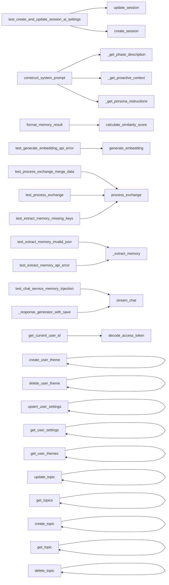

# Module: `backend`

> Auto-generated by Secrin · 2026-02-24

This module is designed to manage user data in a backend application. It includes classes for different entities such as `User`, `UserSettings`, `UserTheme`, `LearningSession`, `Topic`, `ChatHistory`, `UserProfile`, and `MemoryFragment`. The module provides functions to add new records, create tables, get achievements, get user achievements, get user achievement, create a user achievement, update a user achievement, and handle database operations. This module is crucial for maintaining the integrity of user data in the system and facilitating communication between different parts of the application.

## Domain Concepts

- [Model Management](../domains/model-management.md) *(_Models_)*
- [User Management](../domains/user-management.md) *(_Authentication_)*
- [Session Management](../domains/session-management.md) *(_Sessions_)*
- [Chat Service](../domains/chat-service.md) *(_Chat_)*
- [Document Management](../domains/document-management.md) *(_Documents_)*
- [Authentication](../domains/authentication.md) *(_Security_)*
- [Data](../domains/data.md) *(_Database_)*

## Dependencies

**Imported by:** [__root__](../modules/root.md)

## Classes

### `User` — `backend/models.py:19`

这个类 `User` 是一个用于存储用户信息的模型，包含用户 ID、用户名和电子邮件地址。它确保了每个用户都有唯一的用户名，并且电子邮件地址是唯一的。

### `UserSettings` — `backend/models.py:29`

该类定义了一个用于存储用户设置的模型，包括用户ID、Google API密钥等信息。

### `UserTheme` — `backend/models.py:54`

该类定义了一个用于存储用户主题信息的模型，包括用户ID、主题ID和关联的用户ID。

### `LearningSession` — `backend/models.py:65`

这个类定义了一个名为 `LearningSession` 的模型，用于存储学习会的信息。它包含用户 ID、主题和一些其他字段。

### `Topic` — `backend/models.py:83`

该类 `Topic` 表示一个主题，包含用户 ID、名称和创建时间。

### `ChatHistory` — `backend/models.py:95`

`ChatHistory` 是一个用于存储聊天历史的模型类，该类包含用户 ID、会话 ID 和聊天内容等信息。

### `UserProfile` — `backend/models.py:107`

UserProfile类用于存储用户数据，包括用户ID、数据和更新时间。

### `MemoryFragment` — `backend/models.py:116`

这个类 `MemoryFragment` 是一个用于存储和管理内存片段的模型，用于在后端数据库中进行持久化操作。它包含三个关键字段：`id`、`user_id` 和 `topic_id`，分别用于标识内存片段的唯一标识符、用户ID和主题ID。

### `Countdown` — `backend/models.py:127`

这个类 `Countdown` 是一个用于存储和管理用户在某个时间点的计时任务的模型。它包含以下关键字段：

- `id`: 用户 ID，用于唯一标识该计时任务。
- `user_id`: 用户 ID，表示该计时任务所属的用户。
- `title`: 计时任务的标题。

这个类提供了基本的计时功能，包括创建、更新和删除计时任务。

### `Document` — `backend/models.py:136`

`Document` 类用于存储文档信息，包括用户ID、主题ID和创建时间。该类与 `Base` 类一起用于数据库操作。

### `DocumentReaderState` — `backend/models.py:151`

该类用于记录文档阅读状态，包括用户ID、文档ID和状态信息。

### `DocumentNotebook` — `backend/models.py:163`

`DocumentNotebook` 是一个用于存储文档笔记的模型类，它继承自 `Base` 类，并且在表中设置了唯一约束以确保每个用户只能有一个文档笔记。

### `Achievement` — `backend/models.py:174`

该类 `Achievement` 是一个用于存储和管理用户成就的模型，包含字段包括 `id`, `key`, `name`, 和 `description`。通过这些字段，可以方便地记录用户的成就信息，并在需要时进行查询和更新。

### `UserAchievement` — `backend/models.py:187`

该类定义了一个用于存储用户成就的模型，包含用户ID、 achievementID和一些基本信息。

### `UserBase` — `backend/schemas.py:6`

这个类定义了一个用户的基本信息，包括用户名和电子邮件地址。

### `UserCreate` — `backend/schemas.py:11`

这个类定义了一个用于创建用户的新对象，包含一个密码字段。

### `UserResponse` — `backend/schemas.py:15`

`UserResponse` 是一个用于存储用户响应的类，包含 `id`、`is_active` 和 `created_at` 三个属性，并且使用了 `ConfigDict` 来配置模型。

### `Token` — `backend/schemas.py:23`

这个类 `Token` 是一个用于存储用户访问令牌的模型，包含两个字段：`access_token` 和 `token_type`。这些字段分别表示用户的访问令牌和其类型。

### `TokenData` — `backend/schemas.py:28`

`TokenData` 是一个用于存储用户信息的模型类，用于在后端进行数据处理和验证。它包含 `username` 字段，用于存储用户的用户名。

### `UserSettingsBase` — `backend/schemas.py:32`

这个类定义了用户设置的基本信息，包括Google API密钥、OpenAI API密钥、DeepSeek API密钥和Zhipu API密钥。这些密钥用于访问Google Cloud的API，并且这些密钥在实际应用中通常需要进行加密存储以防止泄露。

### `UserSettingsCreate` — `backend/schemas.py:50`

这个类定义了一个用于创建用户设置的类，包括 `user_id` 属性。

### `UserSettingsResponse` — `backend/schemas.py:54`

这个类定义了一个用户设置响应的结构，包括用户ID、创建时间、更新时间等字段，并且使用了 `ConfigDic` 类来配置模型。

### `ThemeBase` — `backend/schemas.py:65`

这个类 `ThemeBase` 是一个用于存储主题信息的模型，包含主题ID、名称、焦点持续时间以及是否为默认主题。

### `ThemeCreate` — `backend/schemas.py:74`

这个类 `ThemeCreate` 是一个用于创建主题的 Schema，它继承自 `ThemeBase` 类。这个类定义了如何创建主题的基本结构和属性。

### `ThemeResponse` — `backend/schemas.py:80`

这个类 `ThemeResponse` 是一个用于表示主题响应的 Python 类，它继承自 `ThemeBase` 类。该类包含 `id`、`user_id` 和 `created_at` 属性，并且使用了 `ConfigDict.from_attributes=True` 来配置属性。

### `SessionBase` — `backend/schemas.py:90`

`SessionBase` 是一个用于存储会话信息的类，包含会话的主题名称、持续时间（以秒为单位）、阶段类型（如 'focus', 'shortBreak', 'longBreak'）和当前状态（如 'completed', 'skipped', 'interrupted'）。

### `SessionCreate` — `backend/schemas.py:104`

这个类 `SessionCreate` 是一个用于创建会话的模型，它继承自 `SessionBase` 类。

### `SessionUpdate` — `backend/schemas.py:108`

这个类 `SessionUpdate` 用于定义一个会话更新的模型，包括主题名称、持续时间（秒）、阶段类型和状态。它还包含一个 `start_time` 属性，用于存储会话开始的时间。

### `SessionResponse` — `backend/schemas.py:120`

这个类定义了一个学习会响应的Schema，用于存储会话的信息和创建时间。它继承自`SessionBase`，并添加了模型配置属性。

### `DailyStats` — `backend/schemas.py:129`

这个类 `DailyStats` 用于存储每日的活动统计信息，包括日期、总焦点分钟数、总会话数以及每个主题的会话数量。

### `ChatContext` — `backend/schemas.py:138`

ChatContext类用于存储聊天请求的上下文信息，包括主题、阶段、剩余时间以及语言。它提供了这些信息以便后续处理和分析。

### `ChatRequest` — `backend/schemas.py:150`

这个类 `ChatRequest` 是一个用于处理聊天请求的模型，它包含以下字段：

- `message`: 一个字符串，表示聊天内容。
- `context`: 可选的 `ChatContext` 对象，用于存储和管理聊天上下文信息。
- `user_id`: 可选的字符串，表示用户的唯一标识符。
- `topic_id`: 可选的整数，表示话题ID。

这个类的主要功能是处理用户发送的聊天请求，并将这些请求存储在数据库中。

### `ChatMessage` — `backend/schemas.py:164`

该类定义了一个包含角色、内容和创建时间的聊天消息模型，用于在后端存储和处理聊天信息。

### `ChatHistoryResponse` — `backend/schemas.py:174`

这个类定义了一个包含聊天历史消息的响应模型，用于在后台服务中传递和处理聊天记录。

### `TopicBase` — `backend/schemas.py:180`

`TopicBase` 是一个用于存储和管理主题信息的 Python 类，包含 `name`、`description` 和 `is_active` 属性。这些属性分别表示主题的名称、描述以及是否是活动状态。

### `TopicCreate` — `backend/schemas.py:188`

这个类 `TopicCreate` 是一个用于创建主题的 Python 类，它继承自 `TopicBase` 类。该类定义了如何创建一个新的主题，并提供了一些基本的属性和方法来操作这个主题。

### `TopicResponse` — `backend/schemas.py:194`

这个类定义了一个 `TopicResponse` 对象，用于表示一个主题响应。该对象包含主题的 ID、用户 ID 和创建时间。通过配置文件 `backend/schemas.py`，我们可以方便地将这个类的实例转换为 JSON 格式，并在后续的代码中使用。

### `UserProfileBase` — `backend/schemas.py:204`

UserProfileBase 是一个用于存储用户数据的模型，包含 `user_id` 和一个 `data` 字典。这个模型在后端处理用户数据时非常有用，因为它允许开发者方便地访问和更新用户的详细信息。

### `UserProfileResponse` — `backend/schemas.py:209`

UserProfileResponse类用于处理用户信息的响应，包括更新时间。该类继承自UserProfileBase，并且使用ConfigDict来配置模型属性。

### `MemoryFragmentBase` — `backend/schemas.py:215`

这个类 `MemoryFragmentBase` 是一个用于存储和管理内存片段的模型，它包含用户 ID、主题 ID（可选）、内容和元数据字段。这些字段用于存储和检索内存片段的信息。

### `MemoryFragmentCreate` — `backend/schemas.py:224`

该类 `MemoryFragmentCreate` 是一个用于创建内存片段的类，它包含一个可选的嵌入列表 `embedding`。这个类在内部文档中详细描述了其功能和用途。

### `MemoryFragmentResponse` — `backend/schemas.py:228`

该类定义了一个内存片段响应的模型，包含ID和创建时间字段。

### `CountdownBase` — `backend/schemas.py:235`

这个类 `CountdownBase` 是一个用于表示计时任务的模型，它包含标题和目标日期两个字段。

### `CountdownCreate` — `backend/schemas.py:240`

`CountdownCreate` 是一个类，用于创建一个计时器的实例。这个类继承自 `CountdownBase` 类，提供了计时器的基本功能和属性。

### `CountdownResponse` — `backend/schemas.py:244`

`CountdownResponse` 是一个类，用于表示用户在某个时间点的计时状态。该类包含 `id`、`user_id` 和 `created_at` 属性，并且使用了 `ConfigDict.from_attributes=True` 来配置模型的属性。

### `DocumentBase` — `backend/schemas.py:252`

`DocumentBase` 是一个用于存储文档信息的模型类，包含标题、文件名、文件类型和一些状态字段。该类在团队内部用于管理文档的详细信息，确保每个文档都有唯一的标识符和状态。

### `DocumentCreate` — `backend/schemas.py:260`

`DocumentCreate` 是一个用于创建文档的类，它包含 `content` 和 `user_id` 属性，并且这些属性是字符串类型。

### `DocumentUploadRequest` — `backend/schemas.py:265`

这个类定义了一个用于上传文档的请求模型，包含文件名、内容类型、标题和主题ID等字段。

### `DocumentUpdate` — `backend/schemas.py:272`

`DocumentUpdate` 类用于表示文档更新的模型，包含 `title` 和 `topic_id` 两个字段。这些字段可以是可选的，以便在某些情况下不提供这些信息。

### `DocumentUploadResponse` — `backend/schemas.py:277`

该类 `DocumentUploadResponse` 用于表示上传文档的响应，包含文档 ID、预签名 URL 和存储键。

### `DocumentResponse` — `backend/schemas.py:283`

这个类 `DocumentResponse` 是一个用于存储文档响应的模型，它包含文档的基本信息，包括文档 ID、用户 ID、存储键（可选）和创建时间。该类的设计旨在简化数据处理和管理，提高代码的可读性和维护性。

### `DocumentDetailResponse` — `backend/schemas.py:293`

`DocumentDetailResponse` 是一个类，用于表示文档的详细信息。它包含一个 `content` 属性，该属性存储文档的具体内容。这个类在团队内部用于处理和展示文档的相关信息。

### `ReaderBookmark` — `backend/schemas.py:297`

该类 `ReaderBookmark` 是一个用于存储和管理书籍阅读记录的模型，包含书籍的 ID、页码、创建时间、笔记、全文和链接高亮 ID 等字段。

### `ReaderHighlightRect` — `backend/schemas.py:306`

该类定义了一个用于表示阅读高亮区域的模型，包含左上角坐标、宽度和高度。

### `ReaderHighlight` — `backend/schemas.py:313`

该类用于存储和管理阅读高亮信息，包括页面编号、矩形区域、创建时间以及文本内容等。

### `DocumentReaderStateUpdate` — `backend/schemas.py:322`

这个类用于管理文档阅读状态的更新，包括 bookmarks 和 highlights。它包含一个列表 `bookmarks` 用于存储书签，另一个列表 `highlights` 用于存储高亮信息。

### `DocumentReaderStateResponse` — `backend/schemas.py:327`

该类定义了一个新的文档读取状态响应，用于表示在后台处理文档读取操作时的状态信息。这个类包含一个 `document_id` 属性，用于存储文档的唯一标识符。

### `DocumentNotebookUpdate` — `backend/schemas.py:331`

`DocumentNotebookUpdate` 是一个用于更新文档笔记的类，它包含一个 `markdown` 字段，用于存储 Markdown 格式的文本内容。这个类在团队内部用于处理和管理文档笔记的更新操作。

### `DocumentNotebookResponse` — `backend/schemas.py:335`

`DocumentNotebookResponse` 是一个用于响应文档笔记更新的类，它继承自 `DocumentNotebookUpdate` 类，并添加了一个新的字段 `document_id` 来表示文档的唯一标识符。这个类的主要功能是处理和返回文档笔记的更新请求。

### `AchievementBase` — `backend/schemas.py:339`

AchievementBase类用于定义一个基本的成就模型，包括关键字段、名称、描述、类别、目标类型和目标值以及是否隐藏。

### `AchievementResponse` — `backend/schemas.py:349`

该类定义了一个名为 `AchievementResponse` 的模型，用于表示一个成就响应的实体，包含 `id` 和 `created_at` 属性，并且使用了 `ConfigDict` 来配置模型的属性。

### `UserAchievementBase` — `backend/schemas.py:356`

这个类定义了一个用户成就的基本信息，包括 achievement ID、当前进度、状态和解锁时间。

### `UserAchievementResponse` — `backend/schemas.py:363`

这个类定义了一个包含用户成就响应的模型，用于存储和管理用户在不同平台上的成就信息。该类继承自 `UserAchievementBase` 类，并添加了 `id`, `user_id`, `updated_at`, 和 `achievement` 属性。同时，它还使用了 `ConfigDict.from_attributes=True` 来自动将属性转换为字典格式，以便于在后续的代码中使用。

### `StatsRangeResponse` — `backend/schemas.py:372`

这个类 `StatsRangeResponse` 用于返回一个包含总关注分钟数、总会话数以及各主题的统计信息的响应对象。每个子类 `DailyStats` 和 `SessionResp` 分别表示一天的统计数据和详细信息，这些数据可能来自不同的数据库表或模型。

### `AchievementService` — `backend/services/achievement_service.py:10`

该类 `AchievementService` 用于检查用户在特定事件类型下的成就记录。它接受一个数据库会话、用户 ID 和事件类型作为参数，并返回满足条件的成就记录。

**Methods:** `check_achievements`, `_handle_session_complete`, `_get_current_streak`

### `AIServiceProvider` — `backend/services/chat_service.py:21`

这个类定义了一个抽象基类 `AIServiceProvider`，用于提供AI服务。该类包含一个抽象方法 `stream_chat`，它接受三个参数：消息、系统提示和一些其他参数。这个方法将返回一个响应字符串。

**Methods:** `stream_chat`, `list_models`

### `GeminiProvider` — `backend/services/chat_service.py:40`

GeminiProvider 是一个 Google Gemini 实现的 AI 服务提供商，用于处理文本和语音输入。它默认使用名为 "gemini-2.0-flash" 的模型。

**Methods:** `__init__`, `_get_client`, `stream_chat`, `list_models`

### `OpenAICompatibleProvider` — `backend/services/chat_service.py:112`

该类定义了一个通用的OpenAI-compatible实现，包括OpenAI、DeepSeek、Zhipu和Ollama等服务。它提供了基本的API调用功能，并且支持多种语言的接口。

**Methods:** `__init__`, `stream_chat`, `_build_messages`, `list_models`

### `AIChatService` — `backend/services/chat_service.py:200`

AIChatService类负责与不同的AI服务进行交互，包括Gemini等。该类包含一个字典 `_providers`，其中键为服务名称，值为对应的AI服务对象。通过这种方式，可以方便地添加或移除不同服务的实例。

**Methods:** `__init__`, `stream_chat`, `_retrieve_memory_context`, `list_models`

### `DocumentService` — `backend/services/document_service.py:13`

该类 `DocumentService` 用于解析上传的文件内容，并返回解析后的字符串。

**Methods:** `parse_file`, `get_upload_url`, `complete_upload`, `create_document`, `get_documents`, `get_document`, `update_document`, `delete_document`

### `MemoryService` — `backend/services/memory_service.py:17`

这个类 `MemoryService` 是一个用于存储和检索内存数据的类，它依赖于两个外部服务：`client` 和 `extractor_model_name`。这些服务负责从数据库或其他来源获取和处理内存数据。

**Methods:** `__init__`, `store_diagnostics`, `get_diagnostics`, `get_client`, `generate_embedding`, `process_exchange`, `_normalize_extracted_data`, `_update_diagnostics_after_extraction` *(+5 more)*

### `StorageService` — `backend/services/storage_service.py:5`

`StorageService` 是一个用于存储和管理 MinIO 服务的类，它通过环境变量获取 MinIO 的端点、访问密钥和配置文件路径。这个类提供了基本的存储操作功能，包括创建桶、上传文件、下载文件等。

**Methods:** `__init__`, `_ensure_bucket`, `get_presigned_upload_url`, `get_presigned_download_url`, `delete_object`

## Functions

- **`add_record`** — `backend/add_408_session.py:6` — 该函数用于在数据库中添加一个新的记录，包含用户ID、主题名称和持续时间（以秒为单位）。
- **`create_tables`** — `backend/create_tables.py:11` — 该函数创建一个新的数据库表，如果这些表不存在。
- **`get_achievements`** — `backend/crud_achievements.py:8` — 该函数从一个数据库中获取所有成就，并返回它们的列表。
- **`get_user_achievements`** — `backend/crud_achievements.py:13` — 该函数从数据库中获取用户成就信息，并返回一个包含所有成就的列表。
- **`get_user_achievement`** — `backend/crud_achievements.py:21` — 该函数从数据库中获取用户成就信息，包括用户ID和成就ID。
- **`create_user_achievement`** — `backend/crud_achievements.py:32` — 该函数在数据库中创建一个用户成就记录，用于跟踪用户的 achievement完成情况。
- **`update_user_achievement`** — `backend/crud_achievements.py:40` — 该函数用于更新用户成就，根据传入的 `ua_id` 和 `update_data` 参数，从数据库中查找并更新对应的 `UserAchievement` 对象。如果找到匹配的对象，则返回该对象；否则返回 `None`。
- **`get_latest_unlocked_achievements`** — `backend/crud_achievements.py:52` — 该函数从数据库中获取最近解锁的用户成就，并返回这些成就的列表。
- **`create_session`** — `backend/crud_sessions.py:7` — 该函数用于在数据库中创建一个新的学习会（Session），并将其与用户关联。
- **`update_session`** — `backend/crud_sessions.py:17` — `update_session` 是一个用于更新学习会（LearningSession）数据的异步函数，它接受一个 `AsyncSession` 对象、一个会话 ID 和一个会话数据字典作为参数。该函数通过 `models.LearningSession` 模型的 `where` 方法和 `va` 方法来查找并更新指定会话的数据。
- **`create_chat_message`** — `backend/crud_sessions.py:31` — 该函数用于在数据库中创建一个聊天消息，并返回该消息的ID。如果需要传递额外的信息（如用户ID、会话ID或主题ID），可以使用可选参数 `session_id` 和 `topic_id`。
- **`get_recent_chat_history`** — `backend/crud_sessions.py:52` — `get_recent_chat_history` 是一个用于获取用户最近聊天历史的异步函数，该函数从数据库中选择特定用户的最新聊天记录，并返回这些记录。
- **`get_user_settings`** — `backend/crud_settings.py:7` — 该函数从数据库中获取指定用户的用户设置信息，返回一个 `models.UserSettings` 对象或 `None`，表示没有找到匹配的记录。
- **`upsert_user_settings`** — `backend/crud_settings.py:16` — 该函数用于更新或创建用户设置，根据传入的 `user_id` 和 `settings_in` 参数获取当前用户的设置，并将新的设置保存到数据库中。如果用户已经存在，则更新现有设置；否则，创建一个新的设置。
- **`get_daily_stats`** — `backend/crud_stats.py:8` — `get_daily_stats` 函数从数据库中获取指定日期的每日专注分钟数，并返回一个包含该数据的 `schemas.DailyStats` 对象。这个函数主要用于分析用户在特定日期期间的专注情况，以便优化团队的工作流程和资源分配。
- **`get_stats_range`** — `backend/crud_stats.py:57` — 该函数从数据库中获取指定日期范围内的所有学习会话，并返回这些会话的详细信息，包括会话ID、开始时间、结束时间等。
- **`get_user_themes`** — `backend/crud_themes.py:7` — 该函数从数据库中获取指定用户的所有主题信息，并返回这些主题的列表。
- **`create_user_theme`** — `backend/crud_themes.py:42` — 该函数用于在数据库中创建一个新的用户主题，并返回该主题的实例。
- **`delete_user_theme`** — `backend/crud_themes.py:52` — 该函数用于从数据库中删除用户主题，根据传入的用户ID和主题ID来实现。
- **`get_topics`** — `backend/crud_topics.py:7` — 该函数从数据库中获取指定用户的所有主题，并返回这些主题的列表。
- **`get_topic`** — `backend/crud_topics.py:28` — `get_topic` 是一个异步函数，用于从数据库中获取特定主题的信息。该函数接受两个参数：`db`（AsyncSession），表示数据库会话对象，`topic_id`（int），表示要查询的主题ID，`user_id`（str），表示要查询的用户ID。函数返回一个 `Optional[models.Topic]` 对象，如果找到符合条件的主题，则返回该主题；否则返回 `None`。  这个函数的主要功能是根据给定的参数从数据库中检索特定的主题信息，并将其返回。
- **`create_topic`** — `backend/crud_topics.py:39` — 该函数用于在数据库中创建一个新的主题，并将该主题的模型数据和用户 ID 附加到新创建的主题对象中。
- **`update_topic`** — `backend/crud_topics.py:49` — 该函数用于更新指定主题的详细信息，包括用户和内容。如果找到匹配的主题，则返回该主题的实例；否则返回 `None`。
- **`delete_topic`** — `backend/crud_topics.py:66` — 该函数用于从数据库中删除指定主题的记录，如果找到并删除成功则返回 `True`，否则返回 `False`。
- **`get_countdowns`** — `backend/crud_topics.py:76` — 该函数从数据库中获取指定用户的所有倒计时，并返回这些倒计时的列表。
- **`create_countdown`** — `backend/crud_topics.py:85` — 该函数用于创建一个新计时器，并将传入的计时器数据转换为模型对象并存储在数据库中。
- **`delete_countdown`** — `backend/crud_topics.py:95` — 该函数用于从数据库中删除一个计时器记录，根据传入的 countdown_id 和 user_id 删除相应的计时器记录。
- **`get_user_by_username`** — `backend/crud_users.py:6` — 该函数从数据库中检索指定用户名的用户信息，并返回第一个匹配的用户对象。
- **`get_user_by_email`** — `backend/crud_users.py:10` — 该函数从数据库中获取指定邮箱的用户信息，返回一个包含用户信息的对象。
- **`create_user`** — `backend/crud_users.py:14` — 该函数用于在数据库中创建一个新的用户，并返回新用户的ID和密码哈希值。

*(100 more functions not shown)*

## Call Graph

