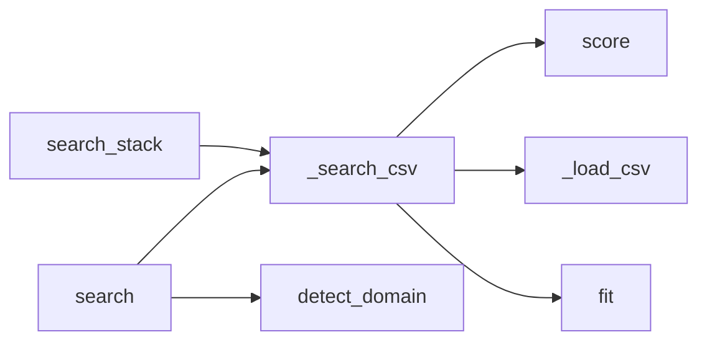

# Module: `skills`

> Auto-generated by Secrin · 2026-02-24

This module is designed to provide a comprehensive solution for text search using the BM25 algorithm. It allows users to search through a large dataset of documents, identify relevant information, and automatically detect and configure skill stacks based on user input. The module also includes functions for loading CSV files, searching specific columns, detecting domain-related keywords, performing searches, and formatting output in Claude's language model.

## Domain Concepts

- [Session Management](../domains/session-management.md) *(_Sessions_)*

## Classes

### `BM25` — `skills/ui-ux-pro-max/scripts/core.py:81`

BM25是一种用于文本搜索的算法，它通过计算文档的相似度来排名文档。该算法基于K1和B的参数，其中K1表示文档的权重，B表示文档的相似度系数。

**Methods:** `__init__`, `tokenize`, `fit`, `score`

## Functions

- **`_load_csv`** — `skills/ui-ux-pro-max/scripts/core.py:144` — 该函数用于从指定的CSV文件中读取数据，并将其转换为Python列表，每个元素是一个字典，包含CSV文件中的每一行数据。
- **`_search_csv`** — `skills/ui-ux-pro-max/scripts/core.py:150` — 该函数用于从CSV文件中搜索特定列，并返回结果。
- **`detect_domain`** — `skills/ui-ux-pro-max/scripts/core.py:175` — 该函数通过将查询字符串转换为小写，然后查找并返回与“color”相关的关键词。这个功能在处理用户输入时非常有用，因为它可以帮助开发者快速识别出用户想要的特定颜色或主题。
- **`search`** — `skills/ui-ux-pro-max/scripts/core.py:195` — 该函数 `search` 用于在给定的查询中进行搜索，并根据提供的域名自动检测和配置。它返回一个包含搜索结果的列表，其中每个元素是一个字典，包含查询结果的字段和值。
- **`search_stack`** — `skills/ui-ux-pro-max/scripts/core.py:217` — 该函数 `search_stack` 用于搜索特定的技能栈指南，根据用户提供的查询和栈配置返回相应的建议或错误信息。
- **`format_output`** — `skills/ui-ux-pro-max/scripts/search.py:15` — 该函数 `format_output` 用于将搜索结果格式化为 Claude可以理解的输出，包括错误信息。

## Call Graph

